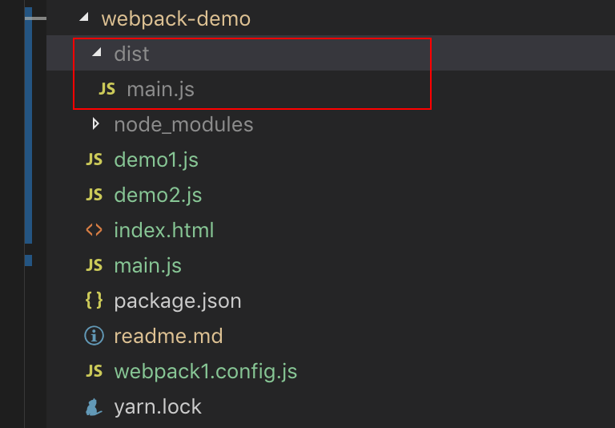
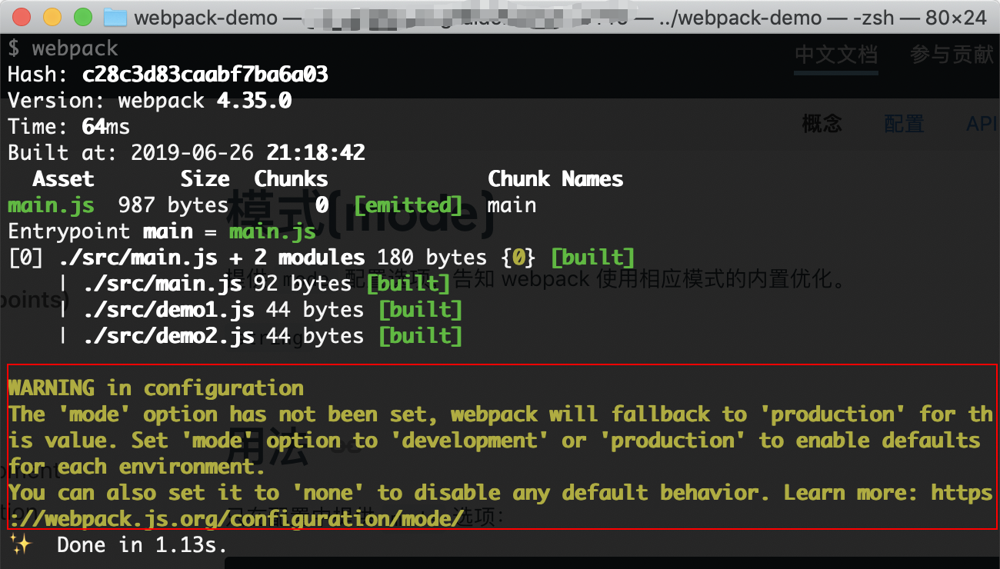
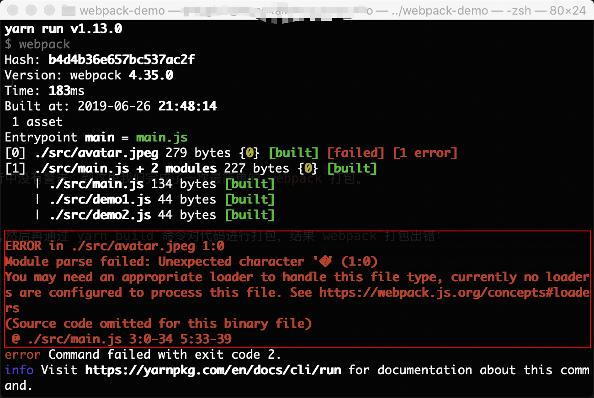

## 安装
在使用`webpack`之前我们要安装`webpack`,安装命令如下：  
```npm
# 创建webpack-demo文件夹
mkdir webpack-demo
# 生成package.json文件，对项目依赖进行管理
yarn init -y
# 安装webpack相关依赖
yarn add webpack webpack-cli -D
```
这里我们安装`webpack-cli`的原因是因为它可以让我们可以在命令行中运行`webpack`,否则`webpack`命令将无法运行

### 生成打包文件

接下来我们再当前目录下新建几个文件来进行演示：  
```js
// demo1.js
const demo1 = 'demo1';
export default demo1;
// demo2.js
const demo2 = 'demo2';
export default demo2;
// main.js
import demo1 from './demo1';
import demo2 from './demo2';

console.log('info', demo1, demo2)
```

之后我们再命令行中执行：  
```npm
npx webpack main.js
```
执行命令之后会发现目录结构中多了如下文件：  


这时我们将打包好的文件通过`index.html`引入：  
```html
<html lang="en">

<head>
  <meta charset="UTF-8">
  <meta name="viewport" content="width=device-width, initial-scale=1.0">
  <meta http-equiv="X-UA-Compatible" content="ie=edge">
  <title>Document</title>
</head>

<body>
  <script src="./dist/main.js"></script>
</body>

</html>
```

在浏览器中打开`html`文件，控制台中已经成功输出：  


### 使用配置文件
使用命令行实现一些简单的`webpac`配置比较快捷，而实际项目中的`webpack`配置比较复杂，创建一个`webpack`配置文件来执行会更加高效。

接下来我们在目录下新建`scr`目录，然后将源代码`demo1.js,demo2.js,main.js`移入进行集中管理。完成之后我们回到项目根目录，建立`webpack.config.js`文件来实现`webpack`的各种配置，并添加如下代码：  
```js
const path = require('path');
module.exports = {
  // 入口： 打包`./scr/index.js`文件
  entry: './src/main.js',
  // 出口： 在./dist目录下输出创建的打包文件
  output: {
    filename: 'main.js', // 输出文件的名称
    path: path.resolve(__dirname, './dist') // 输出文件的目录，要设置为绝对路径
  }
}
```

在书写完配置文件之后，在命令行中运行：  
```npm
npx webpack
```

执行命令之后，可以成功看到和通过命令行执行完全一样的效果。

### `NPM`脚本(`NPM Scripts`)
使用`CLI`这种方式来运行本地的`webpack`进行打包不是特别方便，我们可以设置一个快捷方式命令。在`package.json`中添加一个`script`来进行命令的简写：  
```json
"scripts": {
  "build": "webpack",
},
```
> 这里的`webpack`其实是`webpack --config webpack.config.js`的简写，由于`webpack`的默认配置为`webpack.config.js`,所以我们可以将其简写为`webpack`。而当配置文件用其他名字来命名的话，就需要通过`--config`来指定对应的配置文件

配置好之后，命令行中运行：  
```npm
yarn build
```

在打包的过程中一直有一个黄色的警告我们没有处理：  


这是由于我们再打包的时候没有为`webapck`来指定打包模式。指定对应的打包模式后`webpack`会使用相应模式的内置优化：  
```js
const path = require('path');
module.exports = {
  mode: 'production', // 要为webpack指定打包模式来使用内置优化，不指定默认为`production`，但是会在命令行出现黄色警告
  // 简写：相当于 => entry: {main:'./src/main.js'}
  entry: './src/main.js',
  output: {
    filename: 'main.js',
    path: path.resolve(__dirname, './dist')
  }
}
```

可以看到目录下又成功出现了打包好的文件，并且命令行中没有警告，到这里我们完成了一次最简单的`webpack`打包。

### 打包图片文件
我们在`src`目录下加入一个图片： `avatar.jpeg`,然后再通过`yarn build`命令对代码进行打包，结果`webpack`打包出错：  


这段报错的大概意思是说我们没有一个合适的`loader`来处理图片文件。接下来我们就来介绍一下`webpack`的`loader`的作用。

`loader`用于对模块的源代码进行转换。当我们使用图片或者`CSS`等文件时，`webpack`并不能识别这些文件，通过为这些文件配置对应的`loader`就可以让`webpack`认识这些文件，从而可以在项目中进行开发使用。

这里我们通过`file-loader`来让`webpack`处理图片文件: 
```npm
yarn add file-loader
```
```js
// webpack.config.js
module: {
  rules: [
    {
      test: /\.(png|jpg|jpeg|gif)$/, // 匹配 .png,.jpg,.jpeg,.gif结尾的文件
      use: [
        {
          loader: 'file-loader'
        }
      ]
    }
  ]
}
```

### `SplitChunksPlugin`参数学习

1. 指定`webpack`通过`codeSplitting`生成的代码的名字： 在`import()`方法前边加一行注释，也叫魔法注释
2. `SpliChunksPlugin`参数

### 懒加载
### `preLoading`和`preFetching`
通过魔法注释来进行添加(`magic comments`)

* `prefetching`: 在浏览器加载完成必要的资源后，利用空闲时间来加载该模块
* `preloading`: 和浏览器当前需要加载的资源一同加载

`prefetching`拥有更好的性能，比如页面中需要弹出的模态框可以稍后加载

### `CSS`代码分割
默认`css`文件会打包到`js`中

使用插件： `mini-css-extract-plugin`来代替`style-loader`的作用,并且只在生产环境中开启

### 提升`webpack`打包速度
1. 使用新的`Node,Npm,Yarn`
2. 在尽可能少的模块上使用`loader`
3. 尽量减少插件的使用，最好使用官方推荐的插件
4. `resolve`参数合理配置
5. `DLL`插件优化:  
    a. 第三方模块指打包一次
    b. 引入第三方模块(使用dll文件引入)

`DLL`的优化思路： 将一些每次打包不会发生改动的第三方模块进行单独打包，然后在最终的打包文件中引入，减少第三方模块的打包时间

`DLL`的配置过程：  
* 单独为第三方模块添加一个`webpack`配置文件
* 在配置文件中设置入口文件、出口文件，这里需要注意的是出口配置中需要添加`library`
* 在这个单独的配置文件中通过`webpack.DllPlugin`来生成`manifest.json`映射文件
* 主配置中通过`add-assets-html-plugin`来为`html`中引入生成的第三方模块打包文件
* 主配置中使用`webpack.DllReferencePlugin`来识别映射文件`manifest.json`中被打包的第三方模块,分别对应到代码中`import`等导入模块的位置

`DLL`操作简化插件： `autodll-webpack-plugin`