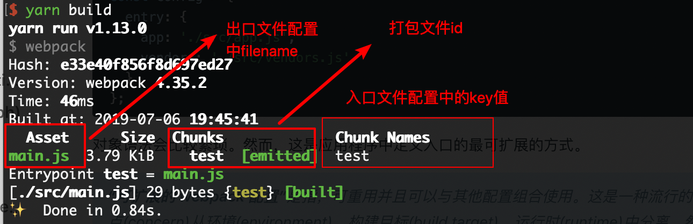

## 安装
在使用`webpack`之前我们要安装`webpack`,安装命令如下：  
```npm
# 创建webpack-demo文件夹
mkdir webpack-demo
# 生成package.json文件，对项目依赖进行管理
yarn init -y
# 安装webpack相关依赖
yarn add webpack webpack-cli -D
```
这里我们安装`webpack-cli`的原因是因为它可以让我们可以在命令行中运行`webpack`,否则`webpack`命令将无法运行

## 生成打包文件
接下来我们建立`src`目录来管理我们的源代码，并建立`main.js`文件，写入第一行代码：  
```js
console.log('Hello webpack!')
```

接下来我们在项目根目录建立`webpack`的配置文件`webpack.config.js`并进行最简单的配置：  
```js
const path = require('path');
module.exports = {
  mode: 'development',
  entry: {
    main: './src/main.js'
  },
  output: {
    path: path.resolve(__dirname, './dist'),
    filename: 'main.js'
  }
}
```

之后我们通过`package.json`文件中的`script`命令来为`webpack`添加快捷命令:  


配置好后通过命令行执行：`yarn build`，会发现根目录出现了`dist`目录，里边有我们的代码`main.js`。

接下来我们在根目录新建`index.html`，通过`script`标签将打包后的代码引入并在浏览器中打开：  


或者可以通过`node`命令来运行打包文件：  


到这里我们成功打包好了我们的第一个文件，感觉还是有些小激动的。

## 入口和出口
在配置之前，我们先简单理解下入口和出口的概念：
* 入口(`entry`): 整个项目的起始模块，用来作为构建其内部依赖图的开始
* 出口(`output`): 告诉`webpack`打包后的文件所存放的目录

这里是一个打包截图：  


了解了基本概念之后，我们来看一下常用的相关配置：  
```js
entry: {
  main: './src/main.js' // 入口文件对应的源代码位置，key值为打包生成后的chunkNames
},
output: {
  path: path.resolve(__dirname, './dist'), // 打包生成文件存放的位置
  // 使用每次构建过程中，唯一的hash生成
  filename: '[name]_[hash].js', // 每个打包输出文件的名称
  // publicPath: 'https://cdn.example.com/assets/', // 会在引入的资源前加入该路径，例：将资源托管到cnd
}
```
在配置文件中我们使用了`[name]`这种符号，这是`webpack`中的占位符(`placeholder`)，这里介绍下配置中使用到的，如果小伙伴们感兴趣可以自己查阅官方文档：  
* `[name]`: 模块名称
* `[hash]`: 模块标识符的`hash`(每次打包都会生成对应唯一的`hash`值)

## 打包模式
在`webpack`中，我们可以通过`mode`选项，来分别为生成环境打包和开发环境打包使用相应的内置优化：  
```js
mode: 'development' 
```
目前我们的配置是开发环境: `development`,当我们使用`production`的时候，`webpack`会将我`node`中的全局变量改为： `process.env.NODE_ENV`的值设置为`production`,并且也会启用代码压缩等功能，有助于帮我们减少代码体积，提升用户体验。

而当我们使用`development`模式时，`webpack`会将`process.env.NODE_ENV`的值设置为`development`,并取消代码压缩等功能，提升开发体验

## 使用插件
在`webpack`中，我们可以使用各种各样的插件来自定义`webpack`构建过程,方便我们的开发。

这里我们介绍2个常用的`plugin`：  
* `HtmlWebpackPlugin`:  自动创建一个`html`文件来帮我们引入打包文件，这对我们每次打包都通过`hash`值来生成不同的打包文件的情况特别有用
* `CleanWebpackPlugin`: 在打包之前删除`output.path`指定的位置中的文件，保证每次打包都是最新的文件

首先我们来安装这俩个插件：  
```npm
yarn add --dev html-webpack-plugin clean-webpack-plugin
```

接下来我们再`webpack`中使用这2个插件：  
```js
// 引入插件
const HtmlWebpackPlugin = require('html-webpack-plugin');
const { CleanWebpackPlugin } = require('clean-webpack-plugin');

plugins: [
  new HtmlWebpackPlugin({
    filename: 'index.html', // 生成html文件的文件名
    template: './index.html' // 使用的html模板
  }),
  new CleanWebpackPlugin()
]
```

这里我们通过为`html-webpack-plugin`来指定根目录下的`index.html`为模版，生成打包后的`index.html`。新生成的`index.html`文件与模板文件不同之处在于会自动引入打包生成的文件(包括`js`文件、`css`文件、以及之后配置的`dll`文件)，这样即使我们使用了`[hash]`等占位符，插件也会自动帮我们动态引入资源，而不用我们每次手工配置。

使用`HtmlWebpackPlugin`指定`template`的原因是因为我们可以在模板文件中自己写一些我们自己的代码，比如引入一些`css`或者执行一段`js`脚本亦或者我们可以在模板文件中指定项目的根元素：  
```html
<!DOCTYPE html>
<html lang="en">

<head>
  <meta charset="UTF-8">
  <meta name="viewport" content="width=device-width, initial-scale=1.0">
  <meta http-equiv="X-UA-Compatible" content="ie=edge">
  <title>Document</title>
</head>

<body>
  <!-- 在模板中指定根元素，方便开发时为其中插入元素 -->
  <div id="root"></div>
</body>

</html>
```

通过使用插件我们目前解决了如下问题：  
1. 不用再手动引入打包文件
2. 不用在重新打包的时候手动去删除旧的打包文件

## 使用`loader`
下面是对`webpack`官网中`loader`介绍的一步分摘抄：
> `loader`用于对模块的源代码进行转换  
> 特性(这里只列出了部分):  
> * `loader`支持链式传递，链中每个`loader`会将转换应用在已处理过的资源上。一组链式的`loader`将按照相反的顺序执行。链中的第一个`loader`将其结果(也就是转换后的资源)传递给下一个`loader`，依次类推
> * `loader`可以通过`options`对象配置
> * 插件可以为`loader`带来更多特性

我个人觉得其实`loader`就是让`webpack`可以识别各种资源，然后将资源加工处理成浏览器可以识别的、兼容性更好的、性能更好的代码。

接下来我们学习如何通过`loader`来让`webpack`处理各种资源。

### 项目中使用`css`
要想使用`css`文件`，我们首先需要安装`style-loader`和`css-loader`：  
```npm
yarn add style-loader css-loader -D
```
在`webpack.config.js`进行配置：  
```js
module: {
  rules: [
    {
      test: /.css$/,
      use: ['style-loader', 'css-loader']
    }
  ]
}
```
但是日常的项目中，有很多`css`属性需要添加浏览器供应商前缀来确保兼容性, 我们可以使用`postcss-loader`结合`autoprefixer`来实现：  
```npm
yarn add postcss-loader autoprefixer -D
```
我们需要为`css`文件添加`postcss-loader`,之后在根目录新建`postcss.config.js`配置`autoprefixer`:  
```js
// webpack.config.js
rules: [
  {
    test: /\.css$/,
    use: [
      'style-loader',
      'css-loader',
      'postcss-loader'
    ]
  }
]

// postcss.config.js
module.exports = {
  plugins: [
    // autoprefixer: parse CSS and add vendor prefixes to CSS rule using values from can I use
    // 解析CSS并使用Can I use 中的值 将供应商前缀添加到css规则中
    require('autoprefixer')
  ]
};
```
平常我们也会用到`css`预处理器来方便开发，这里我们以`sass`为例：  
```npm
yarn add sass-loader node-sass -D
```
在`webpack`中添加如下配置： 
```js
{
  test: /\.scss$/,
  use: [
    'style-loader',
    'css-loader',
    'postcss-loader',
    'sass-loader'
  ]
}
``` 

这里要特别注意`loader`的顺序问题(反向：从下到上，从右到左)：  
* 首先通过`sass-loader`将`scss`文件中的语法解析为`css`语法
* 之后通过`postcss-loader`为对应的`css`属性添加浏览器供应商前缀
* 然后使用`css-loader`根据`import`语法将所有的`css`文件整合到一起
* 最后将`css-loader`整合的`css`文件通过`style`标签插入到`html`中，实现样式的更改

**如果顺序书写错误，会导致程序无法正常运行**

最终效果如下：  


学习了上面的知识以后，我们再了解几个`css-loader`的常用配置：  
````js
{
  test: /\.scss$/,
  use: [
    'style-loader',
    {
      loader: 'css-loader',
      options: {
        // 开启css模块化
        modules: true,
        // 在css-loader前应用的loader的数量：确保在使用import语法前先经过sass-loader和postcss-loader的处理
        importLoaders: 2
      }
    },
    'postcss-loader',
    'sass-loader'
  ]
}
````

### 项目中使用图片和字体图标

## `source map`配置

## `webpackDevServer`方便开发和调试

## 实现代码的热模块更新

## 使用`babel`转义`es6`语法