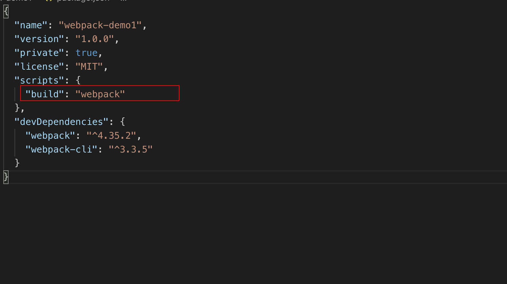
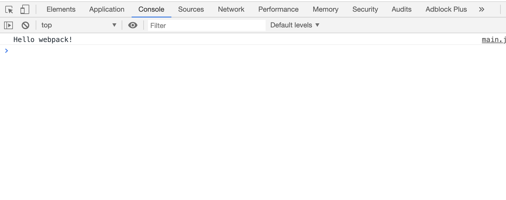
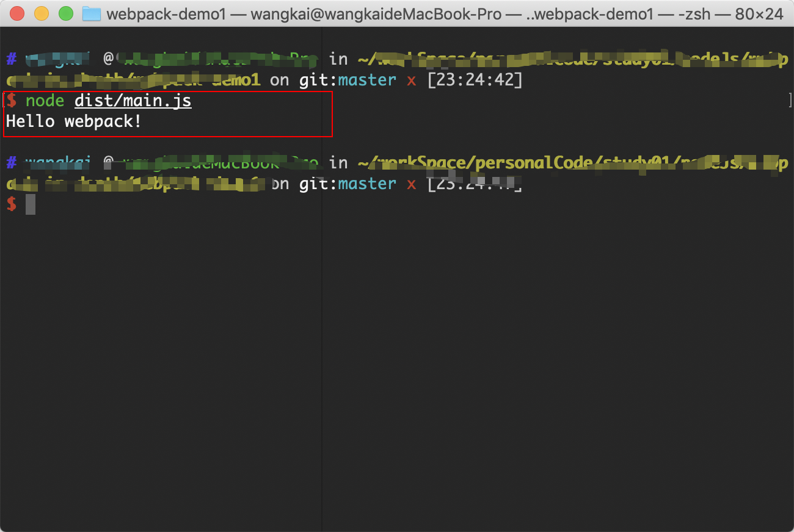

## 安装
在使用`webpack`之前我们要安装`webpack`,安装命令如下：  
```npm
# 创建webpack-demo文件夹
mkdir webpack-demo
# 生成package.json文件，对项目依赖进行管理
yarn init -y
# 安装webpack相关依赖
yarn add webpack webpack-cli -D
```
这里我们安装`webpack-cli`的原因是因为它可以让我们可以在命令行中运行`webpack`,否则`webpack`命令将无法运行

## 生成打包文件
接下来我们建立`src`目录来管理我们的源代码，并建立`main.js`文件，写入第一行代码：  
```js
console.log('Hello webpack!')
```

接下来我们在项目根目录建立`webpack`的配置文件`webpack.config.js`并进行最简单的配置：  
```js
const path = require('path');
module.exports = {
  mode: 'development',
  entry: {
    main: './src/main.js'
  },
  output: {
    path: path.resolve(__dirname, './dist'),
    filename: 'main.js'
  }
}
```

之后我们通过`package.json`文件中的`script`命令来为`webpack`添加快捷命令:  


配置好后通过命令行执行：`yarn build`，会发现根目录出现了`dist`目录，里边有我们的代码`main.js`。

接下来我们在根目录新建`index.html`，通过`script`标签将打包后的代码引入并在浏览器中打开：  


或者可以通过`node`命令来运行打包文件：  


到这里我们成功打包好了我们的第一个文件，感觉还是有些小激动的。

## 入口和出口

## 打包模式